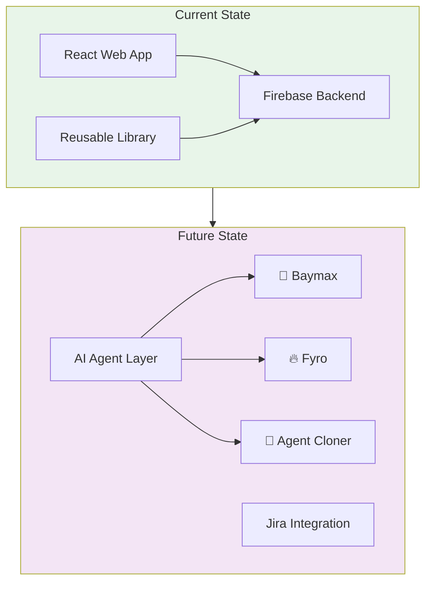

# FDE Space 🚀

A comprehensive platform for Full-stack Development Engineers (FDEs) and Product Managers to track, analyze, and resolve AI/Agent accuracy issues — and soon, leverage AI agents for intelligent analysis and recommendations.

---

## 🧐 Problem Statement

Managing accuracy issues in AI deployments is complex. FDEs often struggle with:
- 📋 Scattered reports across chat channels and spreadsheets
- 🔍 Lack of context for reported issues (screenshots, execution logs)
- 📊 Difficulty in tracking issue resolution status per customer
- 🧠 Absence of aggregated insights to identify recurring model failures

**FDE Space** solves this by providing a centralized, structured, and visual platform for managing the entire lifecycle of accuracy issues — with upcoming AI-powered agents for intelligent analysis.

---

## 📦 Monorepo Structure

```
fde-space/
├── fde-accuracy-tracker/       # Main web application
├── fde-accuracy-tracker-lib/   # Reusable component library
├── ARCHITECTURE.md             # System architecture (coming soon)
└── README.md                   # This file
```

| Package | Description |
|---------|-------------|
| [**fde-accuracy-tracker**](./fde-accuracy-tracker/) | React web app for tracking accuracy issues |
| [**fde-accuracy-tracker-lib**](./fde-accuracy-tracker-lib/) | Reusable library for embedding tracker in other apps |

---

## ✨ Core Features

- **📂 Customer-Centric Organization**: Isolated workspaces for each customer
- **📝 Detailed Issue Tracking**: Model, workflow, execution logs, and proposed fixes
- **📸 Screenshot Gallery**: Visual browsing with dedicated gallery view
- **📊 Insights Dashboard**: Real-time analytics on categories, resolution status, and trends
- **⚡ Demo Mode**: Explore features without backend configuration

---

## 🛠️ Tech Stack

| Layer | Technology |
|-------|------------|
| **Frontend** | React 19, TypeScript, Vite |
| **Styling** | TailwindCSS (Custom Purple Theme) |
| **State** | Zustand |
| **Backend** | Firebase (Firestore, Storage, Auth) |
| **Charts** | Recharts |
| **Icons** | Lucide React |

---

## 🚀 Quick Start

### Running the Web App

```bash
cd fde-accuracy-tracker
npm install
npm run dev
```
Navigate to `http://localhost:5173` — launches in **Demo Mode** if Firebase is not configured.

### Using the Library

```bash
npm install @fde/accuracy-tracker
```

See [fde-accuracy-tracker-lib/README.md](./fde-accuracy-tracker-lib/README.md) for full usage instructions.

---

## 🔮 Roadmap & Upcoming Features

### Phase 1: Core Enhancements
- [ ] **Persistent Authentication**: Re-enable Firebase Auth enforcement
- [ ] **Data Export**: Export issue reports to CSV/PDF
- [ ] **Advanced Filtering**: Date range filters and multi-select categories
- [ ] **Team Collaboration**: Comment threads on specific issues

### Phase 2: AI Agents
- [ ] **🏥 Baymax Agent**: Accuracy issue analyzer that suggests fixes based on patterns
- [ ] **🔥 Fyro Agent**: New use case analyzer for enterprise customers
- [ ] **🧬 Agent Cloner**: Clone agents with different models/prompts

### Phase 3: Agent Platform
- [ ] **🔧 Clone Environment**: Sandbox for testing cloned agents with improved models
- [ ] **💡 Solutions Lab**: Central place for new technical solutions
- [ ] **🔌 Jira Integration**: Create and sync issues bidirectionally

---

## 🏗️ Architecture

For detailed architecture diagrams (current & future state), see:
- [**fde-accuracy-tracker/ARCHITECTURE.md**](./fde-accuracy-tracker/ARCHITECTURE.md)

### High-Level Overview



---

## 📄 License

MIT License

---

## 🤝 Contributing

Contributions are welcome! Please read the contribution guidelines before submitting PRs.
