# FDE Accuracy Tracker - Architecture Diagrams

This document provides both the **current architecture** and the **proposed future architecture** for the FDE Accuracy Tracker application.

---

## Current Architecture

### High-Level System Architecture

```mermaid
flowchart TB
    subgraph Client["🖥️ Client Layer"]
        Browser["Web Browser"]
    end

    subgraph Frontend["⚛️ React Frontend (Vite + TypeScript)"]
        Router["React Router DOM"]
        
        subgraph Pages["Pages"]
            Tracker["Tracker Page"]
            Gallery["Gallery Page"]
            Insights["Insights Page"]
            Dashboard["Dashboard Page"]
            Login["Login Page"]
        end
        
        subgraph Components["Shared Components"]
            Layout["Layout"]
            Sidebar["Sidebar"]
            CustomerSelector["Customer Selector"]
            IssueDetailPanel["Issue Detail Panel"]
            Modals["Modals (Add Customer, Add Issue)"]
        end
        
        subgraph State["State Management"]
            Zustand["Zustand Store"]
        end
    end

    subgraph Backend["☁️ Firebase Backend (Optional)"]
        Auth["Firebase Auth"]
        Firestore["Cloud Firestore"]
        Storage["Firebase Storage"]
    end

    Browser --> Router
    Router --> Pages
    Pages --> Components
    Pages --> State
    State --> Firestore
    Modals --> Storage
    Login --> Auth

    style Frontend fill:#e8f5e9
    style Backend fill:#fff3e0
    style Client fill:#e3f2fd
```



### Component Architecture


### Data Model


### Current Tech Stack

| Layer | Technology |
|-------|------------|
| **Frontend Framework** | React 19 + TypeScript |
| **Build Tool** | Vite 7 |
| **Styling** | TailwindCSS |
| **State Management** | Zustand |
| **Routing** | React Router DOM v7 |
| **Charts** | Recharts |
| **Icons** | Lucide React |
| **Notifications** | React Hot Toast |
| **Backend** | Firebase (Auth, Firestore, Storage) |

---

## Future Architecture (With AI Agents)

### Enhanced System Architecture

```mermaid
flowchart TB
    subgraph Client["🖥️ Client Layer"]
        Browser["Web Browser"]
        ChatUI["Agent Chat Interface"]
    end

    subgraph Frontend["⚛️ React Frontend"]
        Router["React Router DOM"]
        
        subgraph Pages["Enhanced Pages"]
            Tracker["Tracker Page"]
            Gallery["Gallery Page"]
            Insights["Insights Page"]
            Dashboard["Dashboard Page"]
            AgentsHub["🤖 Agents Hub"]
            CloneEnv["🔧 Clone Environment"]
            Solutions["💡 Solutions Lab"]
        end
        
        subgraph AgentPages["AI Agent Interfaces"]
            BaymaxUI["Baymax Agent UI"]
            FyroUI["Fyro Agent UI"]
            ClonerUI["Agent Cloner UI"]
        end
        
        subgraph State["Enhanced State"]
            Zustand["Zustand Store"]
            AgentState["Agent Session State"]
        end
    end

    subgraph AgentLayer["🤖 AI Agent Layer"]
        subgraph Baymax["Baymax Agent"]
            AccuracyAnalyzer["Accuracy Analyzer"]
            FixSuggester["Fix Suggester"]
            PatternDetector["Pattern Detector"]
        end
        
        subgraph Fyro["Fyro Agent"]
            UseCaseAnalyzer["Use Case Analyzer"]
            RequirementExtractor["Requirement Extractor"]
            SolutionDesigner["Solution Designer"]
        end
        
        subgraph Cloner["Agent Cloner"]
            AgentTemplate["Agent Templates"]
            ModelSelector["Model Selector"]
            PromptOptimizer["Prompt Optimizer"]
        end
    end

    subgraph Backend["☁️ Enhanced Backend"]
        Auth["Firebase Auth"]
        Firestore["Cloud Firestore"]
        Storage["Firebase Storage"]
        
        subgraph NewServices["New Services"]
            AgentDB["Agent Configurations DB"]
            CloneRegistry["Clone Registry"]
            SolutionsDB["Solutions Database"]
        end
    end

    subgraph Integrations["🔌 External Integrations"]
        Jira["Jira API"]
        LLMProvider["LLM Provider (OpenAI/Gemini)"]
        ModelRegistry["Model Version Registry"]
    end

    Browser --> Router
    ChatUI --> AgentLayer
    Router --> Pages
    Router --> AgentPages
    Pages --> State
    AgentPages --> AgentLayer
    AgentLayer --> LLMProvider
    AgentLayer --> Firestore
    Baymax --> Firestore
    Fyro --> NewServices
    Cloner --> CloneRegistry
    Tracker --> Jira

    style Frontend fill:#e8f5e9
    style Backend fill:#fff3e0
    style AgentLayer fill:#f3e5f5
    style Integrations fill:#fce4ec
```



### Agent Architecture Detail

```mermaid
flowchart TB
    subgraph BaymaxAgent["🏥 Baymax - Accuracy Issue Analyst"]
        direction TB
        IssueInput["Issue Input"]
        
        subgraph Analysis["Analysis Pipeline"]
            LogParser["Execution Log Parser"]
            ScreenshotAnalyzer["Screenshot Analyzer (Vision)"]
            ContextBuilder["Context Builder"]
        end
        
        subgraph Intelligence["LLM Intelligence"]
            RootCauseAnalysis["Root Cause Analysis"]
            FixGeneration["Fix Generation"]
            SimilarityMatcher["Similar Issue Matcher"]
        end
        
        subgraph Output["Baymax Output"]
            FixSuggestions["Fix Suggestions"]
            PreventionTips["Prevention Tips"]
            ConfidenceScore["Confidence Score"]
        end
        
        IssueInput --> Analysis
        Analysis --> Intelligence
        Intelligence --> Output
    end

    style BaymaxAgent fill:#e3f2fd
```

```mermaid
flowchart TB
    subgraph ClonerSystem["🧬 Agent Cloner System"]
        direction TB
        BaseAgent["Base Agent Selection"]
        
        subgraph Customization["Customization Layer"]
            ModelSwitch["Model Version Switch"]
            PromptTuning["Prompt Tuning"]
            ParameterConfig["Parameter Configuration"]
        end
        
        subgraph Environment["Clone Environment"]
            SandboxEnv["Sandbox Environment"]
            TestSuite["Test Suite Runner"]
            PerformanceMonitor["Performance Monitor"]
        end
        
        subgraph Registry["Clone Registry"]
            VersionControl["Version Control"]
            ABTesting["A/B Testing Config"]
            RollbackManager["Rollback Manager"]
        end
        
        BaseAgent --> Customization
        Customization --> Environment
        Environment --> Registry
    end

    style ClonerSystem fill:#f3e5f5
```






### Future Data Model Extension


### Proposed Feature Modules

| Module | Description | Key Components |
|--------|-------------|----------------|
| **🏥 Baymax Agent** | Analyzes accuracy issues and suggests fixes | Issue Parser, Log Analyzer, Fix Generator, Pattern Matcher |
| **🔥 Fyro Agent** | Analyzes new use cases for enterprise customers | Requirement Extractor, Feasibility Checker, Solution Designer |
| **🧬 Agent Cloner** | Clone and customize existing agents | Template Manager, Model Selector, Prompt Editor |
| **🔧 Clone Environment** | Test environments for cloned agents | Sandbox Runner, Performance Monitor, A/B Testing |
| **💡 Solutions Lab** | Central place for new technical solutions | Solution Catalog, Architecture Templates, Best Practices |
| **🔌 Jira Integration** | Sync issues with Jira projects | Issue Mapper, Status Sync, Comment Sync |

---

## Implementation Roadmap


---

## API Design for Agents

### Baymax Agent API

```typescript
interface BaymaxAnalysisRequest {
  issueId: string;
  includeScreenshots: boolean;
  includeExecutionLogs: boolean;
  analysisDepth: 'quick' | 'detailed' | 'comprehensive';
}

interface BaymaxAnalysisResponse {
  issueId: string;
  rootCause: string;
  suggestedFixes: Array<{
    fix: string;
    confidence: number;
    effort: 'low' | 'medium' | 'high';
  }>;
  similarIssues: Array<{
    issueId: string;
    similarity: number;
  }>;
  preventionRecommendations: string[];
}
```

### Fyro Agent API

```typescript
interface FyroAnalysisRequest {
  customerId: string;
  useCaseDescription: string;
  constraints?: string[];
  priority: 'low' | 'medium' | 'high' | 'critical';
}

interface FyroAnalysisResponse {
  useCaseId: string;
  feasibility: 'feasible' | 'partially_feasible' | 'not_feasible';
  complexityScore: number;
  estimatedTimeline: string;
  recommendedTechStack: string[];
  risks: Array<{
    risk: string;
    severity: 'low' | 'medium' | 'high';
    mitigation: string;
  }>;
  nextSteps: string[];
}
```

---

> [!TIP]
> The agent architecture is designed to be modular. You can start with Baymax for accuracy analysis and incrementally add Fyro and the Agent Cloner as the platform matures.
