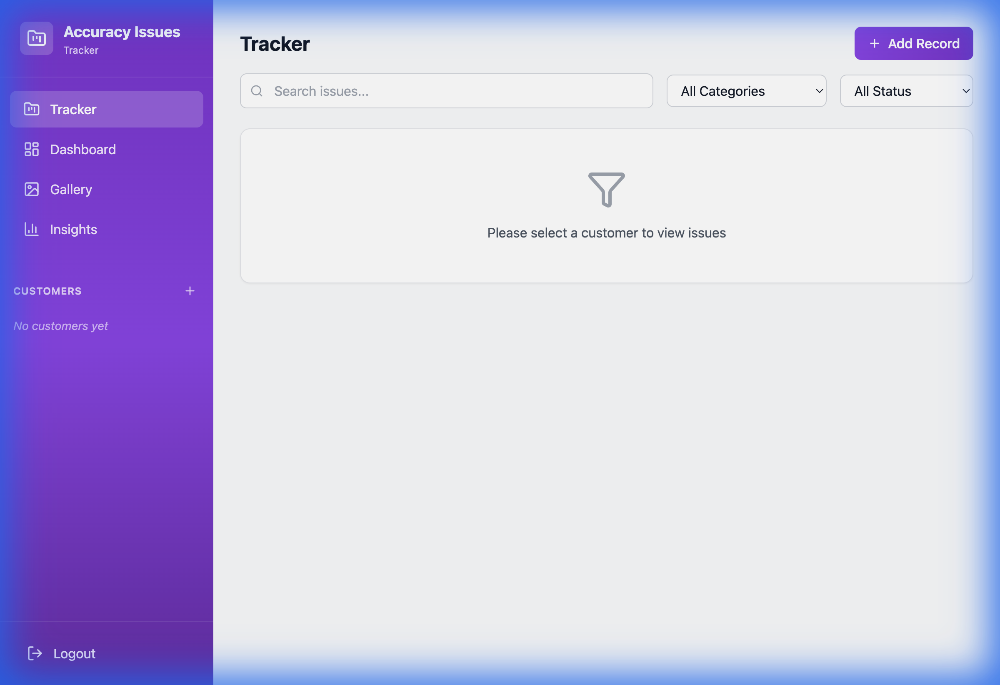
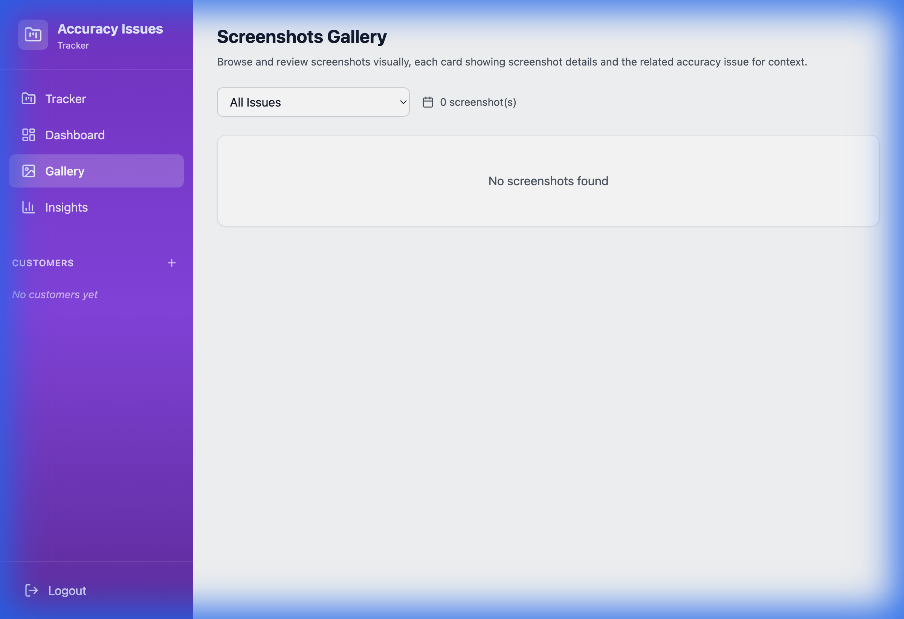
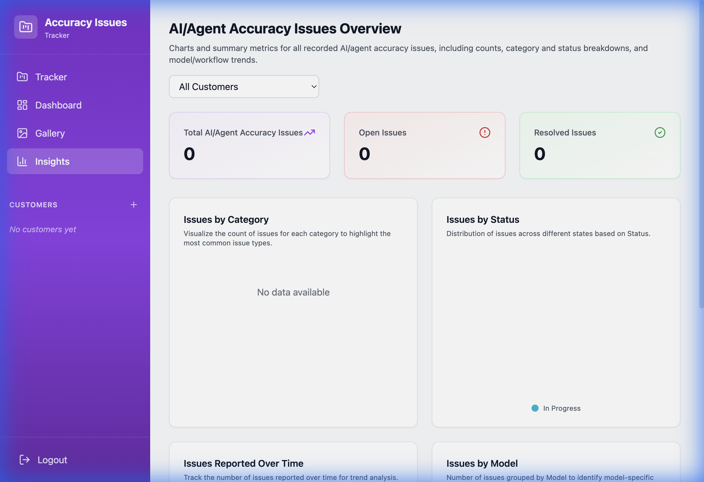

# FDE Accuracy Issues Tracker

A specialized tool designed for Full-stack Development Engineers (FDEs) and Product Managers to track, analyze, and resolve AI/Agent accuracy issues across multiple customers.

## 🧐 Problem Statement

Managing accuracy issues in AI deployments is complex. FDEs often struggle with:
- Scattered reports across chat channels and spreadsheets.
- Lack of context for reported issues (screenshots, execution logs).
- Difficulty in tracking issue resolution status per customer.
- Absence of aggregated insights to identify recurring model failures.

**FDE Accuracy Tracker** solves this by providing a centralized, structured, and visual platform for managing the entire lifecycle of accuracy issues.

## ✨ Features

- **📂 Customer-Centric Organization**: Create and manage isolated workspaces for each customer.
- **📝 Detailed Issue Tracking**: Record comprehensive details including model used, workflow, execution logs, and proposed fixes.
- **📸 Screenshot Gallery**: Visual browsing of issues with a dedicated gallery view, linking images back to their specific issue context.
- **📊 Insights Dashboard**: Real-time analytics on issue categories, resolution status, and reporting trends over time.
- **⚡ Demo Mode**: Built-in offline mode allows exploration of features without backend configuration.

## 🖼️ UI Screenshots

### Tracker View
Manage issues in a detailed table view with expandable details.


### Screenshot Gallery
Visually browse issues through their attached screenshots.


### Insights Dashboard
Analyze trends and metrics to improve model performance.


## 🛠️ Tech Stack

- **Frontend**: React 18, TypeScript, Vite
- **Styling**: TailwindCSS (Custom Purple Theme)
- **State Management**: Zustand
- **Backend (Optional)**: Firebase (Firestore, Storage, Auth)
- **Visualization**: Recharts
- **Icons**: Lucide React
- **Notifications**: React Hot Toast

## 🚀 How to Run Locally

1. **Clone the repository**
   ```bash
   git clone https://github.com/yourusername/fde-accuracy-tracker.git
   cd fde-accuracy-tracker
   ```

2. **Install dependencies**
   ```bash
   npm install
   ```

3. **Start the development server**
   ```bash
   npm run dev
   ```

4. **Open the app**
   - Navigate to `http://localhost:5173`.
   - The app will launch in **Demo Mode** automatically if Firebase is not configured.

_Note: To enable full backend persistence, configure a `.env` file with your Firebase credentials as shown in `.env.example`._

## 🔮 Upcoming Versions

- [ ] **Persistent Authentication**: Re-enable Firebase Auth enforcement (currently bypassed for ease of access).
- [ ] **Data Export**: Export issue reports to CSV/PDF for external sharing.
- [ ] **Advanced Filtering**: Date range filters and multi-select categories for the dashboard.
- [ ] **AI Integration**: Auto-summarize issue descriptions using LLMs.
- [ ] **Team Collaboration**: Comment threads on specific issues.

## 📄 License

MIT License
